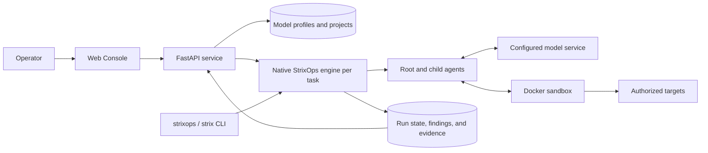
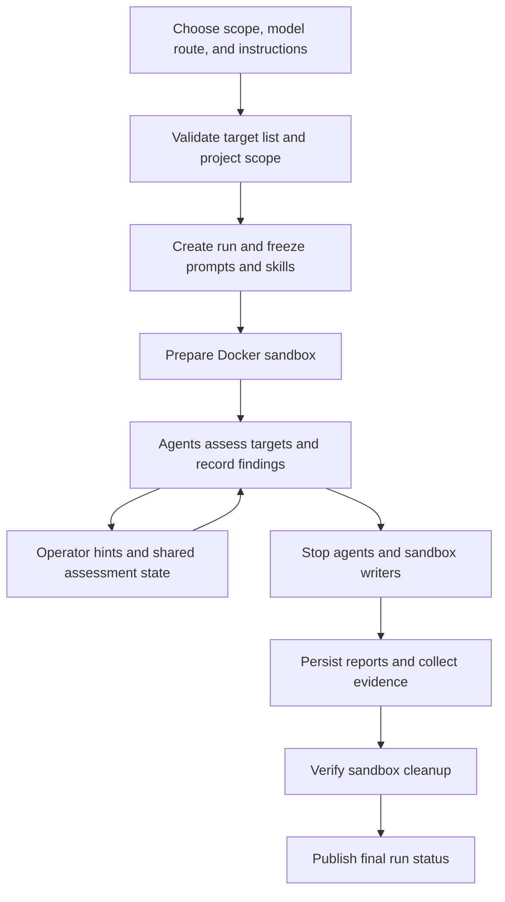

# StrixOps

**A security assessment engine and web console for web applications and internal networks.**

**English** · [简体中文](README.zh-CN.md)

Version **1.1.6** · [Release notes](docs/v1.1.6.md) · [Changelog](CHANGELOG.md) · [Apache-2.0](LICENSE)

StrixOps brings model-driven agents, Docker-based assessment tools, live task
monitoring, findings, and evidence into one workflow. Start an engagement from
the browser or CLI, follow agent activity, add operator guidance, and review a
report alongside the records that produced it.

The Python engine, FastAPI service, and Next.js console are part of the same
product. The Console starts a native engine process for each Web/internal task; both `strixops`
and the compatibility command `strix` invoke that engine. An external Strix
checkout or Python package is not required. The sandbox image does extend an
upstream Strix image; see [Sandbox deployment](#sandbox-deployment) and [NOTICE](NOTICE).

Use StrixOps for systems you are authorized to assess. Model output and reported
coverage require review; a completed task is not a guarantee that a target is secure.

## Contents

- [What you can do](#what-you-can-do)
- [MCP traffic workbench](#mcp-traffic-workbench)
- [Architecture and task lifecycle](#architecture-and-task-lifecycle)
- [Requirements](#requirements)
- [Quick start from source](#quick-start-from-source)
- [Install a built wheel](#install-a-built-wheel)
- [Configure model routes](#configure-model-routes)
- [Run your first assessment](#run-your-first-assessment)
- [CLI usage](#cli-usage)
- [Server deployment](#server-deployment)
- [Sandbox deployment](#sandbox-deployment)
- [Configuration reference](#configuration-reference)
- [Reports, evidence, and storage](#reports-evidence-and-storage)
- [Prompts, skills, and agent behavior](#prompts-skills-and-agent-behavior)
- [Troubleshooting](#troubleshooting)
- [Development and packaging](#development-and-packaging)
- [License and attribution](#license-and-attribution)

## What you can do

| Area | Included capabilities | Practical use |
|---|---|---|
| Web assessments | URL, domain, and IP targets; browser and HTTP tooling; Caido interception in the sandbox | Investigate application behavior and record reproducible findings |
| Internal assessments | Host, IP, and CIDR targets; shared network-tool image; optional SOCKS5 or GSocket access | Assess an authorized internal environment with explicit scope and access instructions |
| MCP traffic workbench | Independent proxy tasks, website capture scope, request inspection and replay, selected-request Agent tests, and Markdown reports | Capture browser traffic and investigate observed pages and APIs with persistent evidence |
| Multi-target tasks | Up to 100 distinct targets in one run | Keep related services under one context, evidence archive, and final report |
| Live Console | Task dashboard, conversation stream, agent tree, operator hints, findings, and downloads | Follow execution and provide additional guidance during a task |
| Projects | Scope validation, task grouping, report aggregation, and skill-use analytics | Organize repeated assessments of the same environment |
| Model profiles | Custom OpenAI-compatible or OpenRouter routes; separate Web/internal models, API types, and reasoning effort | Reuse and compare model configurations without changing engine code |
| Prompt and skill editing | Built-in Markdown library, editor, preview, and per-run snapshots | Maintain instructions while preserving the exact resources used by an existing run |
| Model diagnostics | Tool-call round-trip checks and separate per-file prompt tests | Check route behavior before committing to a full assessment |
| Shared assessment state | Coverage, threat models, authors, and revision history | Keep findings and assessment notes coordinated across agents |
| Reporting | Dynamic and dependency findings, CVSS validation, source/fix metadata, project reports | Review evidence and remediation details together |
| Evidence | Retained workspaces, SHA256 metadata, binary downloads, and ZIP export | Preserve the files referenced by findings and final reports |

The Console is a **single-user application**. It does not provide user accounts,
tenant isolation, or an authentication boundary. Remote deployment should keep
it behind an SSH tunnel or an authenticated access layer.

## MCP traffic workbench

Open **MCP** in the sidebar to create a traffic task, set allowed/excluded
websites, and start its proxy. Configure the test browser's HTTP and HTTPS
proxy with the displayed address. Browse the target to collect requests, then
inspect or replay them, select requests for Agent tests, and export reports.
The workbench captures network requests that actually pass through the proxy;
it does not record every frontend route or automatically explore the website.

MCP tasks use their own capture containers, short-lived request containers,
and data directory (`~/.strixops/mcp_tasks` by default, configurable with
`STRIXOPS_MCP_ROOT`). They remain separate from Web/internal runs. Request tests
can reuse saved Web model routes and compatible prompt/skill resources while
preserving a snapshot for each test.

All tasks in the same MCP data directory share one persistent CA. Import and
trust its public certificate once per test browser/profile. Restarting capture
or creating/deleting tasks does not rotate it. Upgrades prefer an existing
valid CA; a browser that trusted a different legacy CA must trust the shared
one. Running legacy proxies retain their certificate until the next start;
the upgrade does not automatically restart them.

Long task names and URLs stay within their columns, with full values available
in the details. Task deletion requires confirmation, stops its proxy and test
jobs, and removes its saved traffic, results, and reports. The shared CA and
other tasks are retained.

Open MCP through the Console IP and it initializes access automatically, using
the Console deployment’s existing access boundary. Starting capture from a
remote Console address selects a reachable proxy address and generates proxy
credentials; reveal and copy them in the connection panel. No MCP environment
variables are required for this workflow. Explicit token and proxy settings
remain available as advanced overrides.

Capture uses a separate, pinned mitmproxy image. See the
[MCP setup and operation guide](docs/mcp-traffic-workbench.md) for installation,
browser trust, scope rules, storage, and current limits; see the
[1.1.6 release notes](docs/v1.1.6.md) for upgrade commands.

## Architecture and task lifecycle



The built frontend and API share one Console process and origin. A local Docker
daemon provides the assessment environment; no Postgres, Redis, or separate
frontend server is needed for the normal deployment. The model service is
configured separately and receives the context needed by the agent requests.
The diagrams here describe Web/internal runs; MCP has the separate request
testing lifecycle described above.



Failures and ordinary interruptions also enter cleanup and evidence handling.
Forced process termination or host failure may leave recovery work to the
operator. Successful completion is published only after report persistence and
verified container cleanup.

## Requirements

| Component | Requirement | When needed |
|---|---|---|
| Host OS | Linux or macOS / POSIX environment | Engine, CLI, and Console |
| Python | 3.12 or newer | Engine, CLI, and Console |
| Docker | Running Linux-container daemon accessible to the account running StrixOps | Real assessments |
| Sandbox image | `strixops-sandbox:1.3.0`, or a compatible image selected with `STRIXOPS_IMAGE` | Real assessments |
| MCP proxy image | Pinned `ghcr.io/mitmproxy/mitmproxy:12.2.3` with the digest in the [MCP guide](docs/mcp-traffic-workbench.md#安裝與啟動) | MCP capture and request replay |
| Model service | OpenAI-compatible API with the selected protocol, streaming, and function tools | Assessments and model diagnostics |
| Git and uv | Source checkout and frozen Python dependency installation | Source deployment |
| Node.js and npm | Node.js 20.9+ for the current locked frontend dependencies | Frontend source builds only |
| Network and disk | Access to the model service, authorized targets, image/build sources, and space for workspaces and evidence | Depends on the engagement |

The host runs the Console and Python engine; assessment tools run in the Docker
sandbox. Image tool availability can differ by CPU architecture. Some optional
internal tools are installed on a best-effort basis; inspect the image if your
engagement depends on a particular tool.

The Console uses POSIX facilities such as `fcntl`; native Windows execution is
not supported by this implementation. Windows users need a Linux environment
with working Docker access and compatible workspace bind mounts.

## Quick start from source

Run these commands in a shell with Git, uv, Node.js/npm, and Docker available:

```bash
git clone --branch v1.1.6 https://github.com/0xG1w4/StrixOps.git
cd StrixOps

npm --prefix console/web ci
npm --prefix console/web run build
uv sync --frozen --no-dev
bash containers/build-images.sh

uv run --no-dev strixops-console --runs-root "$PWD/strix_runs"
```

Open **[http://127.0.0.1:8300](http://127.0.0.1:8300)**.

Build the frontend before `uv sync`: the Python package includes
`console/web/out`, which does not exist in a fresh clone until the frontend
build finishes.

1. Open **Settings** and create a model profile with its provider URL, API key,
   and Web/internal model assignments.
2. Choose an API mode and reasoning effort, then use **Test model** to check the
   streaming tool-call and tool-result flow.
3. Open the scan launcher, supply an authorized target and instructions, and
   start the task.
4. Use the run page to inspect conversation, agents, findings, reports, and evidence.

Use an **absolute runs path**, as shown above. The Console starts engine processes
with its own working directory; a relative runs path can resolve differently
between the Console and engine, especially in a wheel installation.

The clone command selects the `v1.1.6` **release tag**, leaving a detached HEAD
at that release snapshot. It does not select a maintained release branch.
In an existing checkout, the exact reference is `refs/tags/v1.1.6`.

After installation, subsequent starts only require:

```bash
cd /path/to/StrixOps
uv run --no-dev strixops-console --runs-root "$PWD/strix_runs"
```

A health check verifies the Console service, without starting a scan or making a
model request:

```bash
curl --fail http://127.0.0.1:8300/api/health
```

The health endpoint does not validate Docker, a model key, or target reachability.

## Install a built wheel

A wheel contains the built Console and runtime prompt/skill library. It does
not contain the Docker sandbox image. Use this route when you already have a
trusted `strixops-1.1.6-py3-none-any.whl`; it does not assume a PyPI publication or
an uploaded GitHub Release asset. See [Packaging](#packaging) to build one.

```bash
python3 -m venv .venv
.venv/bin/python -m pip install ./strixops-1.1.6-py3-none-any.whl
.venv/bin/strixops --version
.venv/bin/strixops-console --runs-root "$PWD/strix_runs"
```

Node.js is not required to run this wheel. Build the sandbox using the
`containers/` files from the matching source checkout, or provision a compatible
image separately. The service account needs access to Docker and write access to
its state directories. Console prompt/skill edits also require write access to
the installed package's resource directories.

## Configure model routes

A profile contains one provider URL and API key, plus separate model assignments
for Web and internal tasks. An empty model slot inherits the other slot's model,
API type, and reasoning effort together.

| Option | StrixOps behavior |
|---|---|
| Custom route | Use the supplied OpenAI-compatible Base URL, API key, and model ID |
| OpenRouter | Use the built-in OpenRouter endpoint and provider catalog model ID |
| `Chat Completions` | Send the Chat Completions request format to the Base URL's `/chat/completions` endpoint |
| `Responses` | Send the Responses request format to the Base URL's `/responses` endpoint |
| `Auto` | Select a protocol using the model-name rules shipped with StrixOps; it does not probe or negotiate support |
| `Provider default` effort | Omit the reasoning-effort override |
| `none` effort | Send an explicit value; it is different from omitting the parameter |
| Duplicate | Open a new profile draft; reuse the saved key only for the same provider and endpoint |
| Test model | Make two short streamed requests using a harmless function and its returned result |

For example, a Base URL of `https://gateway.example/v1` produces
`https://gateway.example/v1/chat/completions` or
`https://gateway.example/v1/responses`. Enter the API base, not the complete
completion endpoint. Use the model ID recognized by that particular gateway.

In this release, Auto chooses Responses for the recognized Astra, GPT-5.4 Pro, GPT-5.5,
and GPT-5.6 names; other names use Chat Completions. Set deployment aliases
explicitly. Manual API choices are honored; native-model compatibility notes
are advisory. Unsupported option values and known unsupported effort levels
are still rejected. Provider support ultimately determines whether a request works.

Both modes use OpenAI-compatible formats, but a gateway may implement only one
of them or support only a subset of tools, images, and reasoning settings.
A model appearing in the catalog does not prove compatibility. Failed requests
do not silently switch API, effort, or model. Model tests use normal provider quota.

New Console profiles default to Auto. CLI requests without `LLM_API_MODE` retain
Chat Completions for backward compatibility. CLI environment configuration and
saved Console profiles are separate: configure a saved profile for Console launches.

## Run your first assessment

| Step | What to provide or inspect |
|---|---|
| 1. Scope | Web or internal task type, authorized target(s), and optional project |
| 2. Access | Relevant credentials/access instructions; internal tunnel settings if needed |
| 3. Instructions | Assessment objectives, boundaries, exclusions, and report language |
| 4. Route | Saved model profile and its matching Web/internal assignment |
| 5. Execution | Live conversation, agent tree, recorded coverage, findings, and operator hints |
| 6. Review | Final report, finding details, unresolved coverage, and evidence delivery status |

The Console keeps the single-target form as its default. **Multi-target task**
creates one native run rather than a queue of independent scans.

| Limit | Console | CLI |
|---|---|---|
| Target count | 1 in single-target mode; 2–100 in multi-target mode | 1–100 distinct targets |
| Text import | UTF-8 `.txt`, up to 512 KiB | `--target-list`, up to 1 MiB per file |
| Target length | Up to 2,048 characters | Up to 2,048 characters |
| Normalization | Ignore blank lines and full-line `#` comments; merge exact duplicates | Same |
| Shared settings | One task type, model route, and instruction set | Same |

All targets share agent context, assessment state, evidence, and the final report.
Project scope is checked for the full target list again at launch. Reruns, search,
and report aggregation preserve that list. Importing targets does not stage a
source repository or an API specification.

## CLI usage

The CLI reads model configuration from the environment. Replace the placeholders
with your own route and an authorized lab target before executing these examples:

```bash
export LLM_API_BASE="https://gateway.example/v1"
export LLM_API_KEY="YOUR_API_KEY"
export STRIX_LLM="YOUR_MODEL_ID"
export LLM_API_MODE="auto"
export LLM_REASONING_EFFORT="default"
export STRIX_RUNS="$PWD/strix_runs"

uv run --no-dev strixops \
  --target https://app.lab.example \
  --scan-type web \
  --instruction-file ./engagement.md \
  --report-language en
```

Multiple targets, including a list file, are combined into one ordered scope:

```bash
uv run --no-dev strixops \
  -t https://app.lab.example \
  -t https://api.lab.example \
  --target-list ./targets.txt \
  --instruction-file ./engagement.md
```

An internal-network example:

```bash
uv run --no-dev strixops \
  --target 192.0.2.10 \
  --scan-type internal \
  --socks5 socks5://proxy.lab.example:1080 \
  --instruction-file ./engagement.md
```

`192.0.2.10` and `proxy.lab.example` are documentation placeholders. The SOCKS5
address must be reachable from the Docker sandbox; a proxy bound only to the
host's loopback is not automatically reachable from the container. Replace the
example with your reachable proxy address. A tunnel provides network access and
does not itself establish a remote shell.

| Flag | Purpose |
|---|---|
| `-t`, `--target` | Add a target; can be repeated |
| `--target-list` | Add targets from a UTF-8 file; can be repeated |
| `--scan-type web\|internal` | Select the assessment workflow |
| `--instruction-file` | Load operator instructions from Markdown |
| `--instruction` | Inline fallback when no instruction file is supplied |
| `--socks5` / `--gsocket` | Select internal reachability settings; do not combine them |
| `--crypto` | Enable the optional internal crypto-asset assessment emphasis |
| `--report-language en\|zh-CN` | Select report/finding language; default is `zh-CN` |
| `--version`, `--help` | Inspect the installed version and CLI surface |

For a wheel installation, replace `uv run --no-dev strixops` with
`.venv/bin/strixops`. A successful run returns exit code `0`; failures return a
nonzero code, with details in the run directory. There is no resume command;
a rerun starts a new assessment.

## Server deployment

### Linux service

The following is an example deployment layout, not a bundled installer:

| Path | Contents |
|---|---|
| `/opt/StrixOps` | Source checkout, installed `.venv`, and built Console |
| `/var/lib/strixops/console.json` | Model profiles and integration settings |
| `/var/lib/strixops/projects.json` | Project metadata |
| `/var/lib/strixops/project_reports` | Aggregated project reports |
| `/var/lib/strixops/runs` | Run state, findings, workspaces, and evidence |

Prepare a `strixops` service account, install and build the source checkout at
`/opt/StrixOps` using the quick-start steps, and make these directories writable
by that account. Grant it access to the Docker daemon according to your host's
administration policy. Docker access is privileged host access. If you use the
Console editor, the account also needs write permission to
`src/strixops/agents/prompt_parts` and `src/strixops/skills/content`.

Save the following as `/etc/systemd/system/strixops-console.service`:

```ini
[Unit]
Description=StrixOps Console
Wants=network-online.target
After=network-online.target docker.service

[Service]
Type=simple
User=strixops
Group=strixops
WorkingDirectory=/opt/StrixOps
Environment=HOME=/var/lib/strixops
Environment=STRIXOPS_CONSOLE_CONFIG=/var/lib/strixops/console.json
Environment=STRIXOPS_PROJECTS_FILE=/var/lib/strixops/projects.json
Environment=STRIXOPS_PROJECT_REPORTS_DIR=/var/lib/strixops/project_reports
ExecStart=/opt/StrixOps/.venv/bin/strixops-console --host 127.0.0.1 --port 8300 --runs-root /var/lib/strixops/runs
Restart=on-failure
RestartSec=5
TimeoutStopSec=300
UMask=0077

[Install]
WantedBy=multi-user.target
```

Enable the service and inspect its logs:

```bash
sudo systemctl daemon-reload
sudo systemctl enable --now strixops-console
sudo systemctl status strixops-console
sudo journalctl -u strixops-console -f
```

The timeout above is a deployment example, not a guarantee that every cleanup
finishes in five minutes. Stop active tasks through the Console and wait for
finalization before planned service restarts, upgrades, or host shutdowns.

### Remote access

Keep the default loopback listener and open an SSH tunnel from your workstation:

```bash
ssh -N -L 18300:127.0.0.1:8300 user@your-server
```

Open [http://127.0.0.1:18300](http://127.0.0.1:18300) locally. If using a reverse
proxy instead, provide authentication and TLS at that layer, forward both the
UI and `/api/*`, and preserve long-lived streaming responses without buffering.
Do not expose `--host 0.0.0.0` directly as a public unauthenticated service.

### Backups and upgrades

1. Stop active assessments and let their evidence/cleanup finish.
2. Back up the run directory and Console/project/report settings paths above.
3. Back up edited prompt and skill files from the source checkout or installed
   package; package upgrades or checkout changes can overwrite them.
4. Update the intended branch or install the intended wheel. For source updates,
   rerun `npm --prefix console/web ci`, `npm --prefix console/web run build`,
   and `uv sync --frozen --no-dev`.
5. Rebuild the sandbox when its Dockerfile, base, or selected image changes.
6. Restart the Console and check `/api/health`, then verify the model route
   before starting another assessment.

Run snapshots preserve historical prompt/skill inputs; they do not automatically
restore the editable library or resume a stopped scan. Keep backups private:
settings contain provider credentials, and assessment output may contain
sensitive evidence.

## Sandbox deployment

Web and internal tasks use the same default image:

| Layer | Image / behavior |
|---|---|
| Upstream base | `ghcr.io/usestrix/strix-sandbox:1.3.0` |
| StrixOps image | `strixops-sandbox:1.3.0` |
| Additions | Internal-network tooling, tunnel utilities, workspace layout, and tool paths |
| Web workflow | Enables Caido proxy interception |
| Internal workflow | Disables Caido and applies requested tunnel settings |

Build and inspect it on the Docker host:

```bash
bash containers/build-images.sh
docker image inspect strixops-sandbox:1.3.0
```

To use a custom local tag while retaining the current upstream base:

```bash
BASE_IMAGE=ghcr.io/usestrix/strix-sandbox:1.3.0 \
  bash containers/build-images.sh custom
export STRIXOPS_IMAGE="strixops-sandbox:custom"
```

The script's positional tag also determines its default upstream base tag,
so set `BASE_IMAGE` explicitly when your local tag differs. To use your own
compatible registry image, set `STRIXOPS_IMAGE` to that image reference in the
Console/CLI environment. StrixOps requires a local build for the
`strixops-sandbox` image name; other missing configured images are pulled through
Docker. Registry access and authentication must already be available.

The repository provides a **sandbox Dockerfile**, not a complete Console
Docker/Compose deployment. The wheel and frontend build do not build or package
that image. See [the Dockerfile](containers/Dockerfile.sandbox) for the actual
tool inventory and architecture-specific best-effort installs.

Use a Docker daemon that can bind-mount the engine's workspace paths. Setting a
remote `DOCKER_HOST` alone does not make local workspace directories available on
that remote host. The product version `1.1.6` and sandbox tag `1.3.0` are separate
version numbers.

## Configuration reference

### Model and persistent state

| Variable | Default / meaning |
|---|---|
| `LLM_API_BASE` | Required for CLI assessments; API base URL |
| `LLM_API_KEY` | Required for CLI assessments; provider credential |
| `STRIX_LLM` | Required for CLI assessments; route's model ID |
| `LLM_API_MODE` | `chat_completions`; also accepts `auto` and `responses` |
| `LLM_REASONING_EFFORT` | `default`; selectable values include `none`, `minimal`, `low`, `medium`, `high`, `xhigh`, `max`, subject to model support |
| `STRIX_RUNS` | `<current working directory>/strix_runs`; prefer an absolute path; Console `--runs-root` takes precedence |
| `STRIXOPS_CONSOLE_CONFIG` | `~/.strixops/console.json` |
| `STRIXOPS_PROJECTS_FILE` | `~/.strixops/projects.json` |
| `STRIXOPS_PROJECT_REPORTS_DIR` | `~/.strixops/project_reports` |
| `STRIXOPS_IMAGE` | `strixops-sandbox:1.3.0` for both scan types |
| `STRIX_HOST_WORKSPACE_DIR` | Optional operator-provided workspace bind mount; otherwise retained per-run workspace |
| `STRIX_OPERATOR_HINTS_DIR` | Optional hint directory; Console launches provide a run-owned path |
| `STRIXOPS_REPORT_LANG` | `zh-CN`; CLI `--report-language` takes precedence |
| `STRIXOPS_REPORT_SYNTHESIS` | Enabled; `0` disables model-assisted final report synthesis |
| `PERPLEXITY_API_KEY` | Optional web-search key; can be saved in Console Settings → Integrations |
| `PERPLEXITY_ENABLED` | Optional search switch; defaults to true, but a key is still required |
| `PERPLEXITY_MODEL` | `sonar` (default) or `sonar-reasoning-pro` |
| `PERPLEXITY_TIMEOUT_SECONDS` | Search timeout, 10–300 seconds; default 30 / 300 by model |

The CLI reads environment variables, not a project `.env` file automatically.
The Console writes profile settings server-side and masks keys in API readback;
the settings file is stored with mode `0600`. Masking is not encryption at rest.

See the [web search guide](docs/web-search.md) for Perplexity setup, connection
testing, per-task usage and how scans continue when search is unavailable.

### Agent and context limits

| Variable | Default | Controls |
|---|---|---|
| `STRIXOPS_AGENT_MAX_DEPTH` | `2` | Maximum delegation depth; root is depth 0 |
| `STRIXOPS_AGENT_MAX_ACTIVE` | `4` | Active agents |
| `STRIXOPS_AGENT_MAX_TOTAL` | `12` | Lifetime agents, including the root |
| `STRIX_CONTEXT_AUTO_COMPACT` | `true` | Automatic conversation compaction |
| `STRIX_CONTEXT_BUFFER_TOKENS` | `20000` | Context reserve |
| `STRIX_CONTEXT_KEEP_TOKENS` | `8000` | Recent history retained around compaction |
| `STRIX_CONTEXT_FALLBACK_TOKENS` | `200000` | Context limit when model metadata is unavailable |
| `STRIX_CONTEXT_SUMMARY_TOKENS` | `4096` | Summary output budget |
| `STRIX_TOOL_OUTPUT_MAX_TOKENS` | `8000` | Tool-output token budget |
| `STRIX_TOOL_OUTPUT_MAX_LINES` | `2000` | Tool-output line limit |
| `STRIX_TOOL_OUTPUT_MAX_BYTES` | `51200` | Tool-output byte limit |
| `STRIX_MAX_CONTEXT_IMAGES` | `3` | Recent image outputs retained |

These limits are **not monetary budgets**. Model calls also occur during
compaction, finding deduplication, report synthesis, and diagnostics. Set the
fallback context limit to the actual model's capacity when metadata is missing.

## Reports, evidence, and storage

Each task creates `<runs-root>/<slug>_<4hex>/` before slow initialization. The
Console can show launch errors even when the sandbox or model fails early.

```text
<run>/
├── run.json                      Run metadata and status
├── events.jsonl                  Structured lifecycle and agent events
├── engine.log                    Console-launched engine stdout/stderr
├── assessment.json               Shared coverage and threat-model state
├── penetration_test_report.md    Final assessment report
├── vulnerabilities.json / .csv   Structured vulnerability findings
├── vuln-NNNN.md                  Individual vulnerability records
├── internal_findings/            Internal assessment findings
├── evidence/                     Archived evidence files and delivery metadata
├── workspace/                    Default retained sandbox workspace
├── operator_hints/               Guidance supplied during the run
└── .state/
    ├── agents.db                 Per-agent conversation sessions
    ├── agents.json               Agent state
    ├── prompt_resources.json     Frozen prompt and skill contents
    ├── prompt_manifest.json      Resource hashes
    └── prompt_*.md               Agent prompt snapshots
```

Files depend on task progress and outputs; not every run produces every artifact.
An operator-supplied workspace replaces the default workspace location. See the
[platform code](src/strixops/platform) for the event and artifact contracts.

- Findings validate CVSS metrics and preserve dynamic findings separately from
  dependency context such as package/version, manifest, advisory score,
  reachability evidence, source location, and fix details.
- Final synthesis uses the configured model, recorded findings, assessment state,
  and closing narrative. Deterministic report composition is the fallback if
  synthesis fails or is disabled.
- Agents and sandbox writers stop before evidence is captured. Files are copied
  with streamed SHA256 and no fixed 50 MiB cutoff; both workspace originals and
  archive copies can occupy disk space.
- Missing references, failed copies, symlinks, and special files are recorded as
  incomplete rather than delivered. Review delivery status alongside the report.
- Coverage is agent-reported. Older runs without assessment records display
  unknown coverage; completion and absence of findings do not imply full coverage.

## Prompts, skills, and agent behavior

### Editing and consistency

The **Skills** page lists system prompt parts and skill Markdown files. Edit,
preview, and save there; changes affect **subsequent runs**. A running task and
its children use its frozen resource snapshot, rather than later library edits.
Built-in prompts live in [prompt_parts](src/strixops/agents/prompt_parts), and
skills in [skills/content](src/strixops/skills/content).

Children receive their scope and assignment explicitly and may delegate within
the configured limits. Shared coverage and threat-model tools keep revisions and
authors. When parent context is inherited, it is a snapshot, not a live feed of
later parent messages. Only successful lifecycle tools can complete an agent.

Each agent has its own conversation session. Context compaction preserves recent
history and keeps tool calls/results together; overflow can trigger up to two
forced compactions per cycle. Oversized tool output is previewed and saved in
full under `/workspace/.tool-output/` when storage succeeds. Image use requires
a model route that accepts image inputs.

### Prompt diagnostics versus route diagnostics

| Check | Input and behavior | What the result establishes |
|---|---|---|
| Settings → Test model | Two short streamed requests with a harmless function and function result | Whether that route can complete the tested tool round trip |
| Skills → Prompt test | One streamed request per selected saved file, using it unchanged as system instructions and your required task as the user message; no tools | The observed reply/refusal behavior for that file, task, and route |

Prompt tests do not assemble a full scan prompt or expand template variables.
Results distinguish ordinary responses, structured refusals, explicit policy
blocks, provider errors, and inconclusive results. **No refusal observed** means
no refusal signal was detected; read the reply to evaluate task completion.
A passing fragment test does not predict a full assessment's acceptance.

The dialog supports progress and cancellation, and records the task, reply,
source/task hashes, route, model, API, effort, and time. Replies have credential
redaction and an explicit truncation flag beyond the 32,768-character display
limit. Results last for the current dialog session. Refresh the catalog after
changing files or routes. An explicit `cyber_policy` result stops the remaining
batch; opening the dialog alone makes no model request.

Project skill analytics count recorded dynamic loads and explicit agent-injection
events. The overview starts with five entries and can expand to the full list.
Counts do not measure skill effectiveness or enumerate every automatic preload.

## Troubleshooting

| Symptom | Check / action |
|---|---|
| Console is reachable but the UI is missing or outdated | Rebuild `console/web/out` with `npm --prefix console/web run build`; use `strixops-console` to serve the static export |
| Prompt save returns 404 | Update to a build with the `PUT` save fix and refresh the browser; both Prompt and Skill writes use `PUT` |
| Prompt/skill save fails after wheel installation | Check write permissions on the installed package's resource directories |
| Task appears in a different runs directory | Use an absolute `--runs-root` and inspect the Console's reported root |
| Sandbox image is missing | Build `strixops-sandbox:1.3.0`; confirm the Console account sees the same Docker daemon and image |
| Docker connection or socket error | Check that Docker is running and accessible to the service account; inspect the underlying daemon error |
| Model is listed but the task fails immediately | Test the exact route/model/API/effort combination; model listing alone is insufficient |
| Chat request rejects tools with reasoning | Check the upstream model and gateway's supported combinations, then configure a compatible API/effort explicitly |
| `Response API in-stream error` | Inspect safe error codes and request/gateway IDs in the run log and correlate them with provider logs |
| Explicit `cyber_policy` rejection | Check the actual upstream API organization/project's authorization with the provider; protocol or effort changes do not grant access |
| Unknown model reaches context limits | Set `STRIX_CONTEXT_FALLBACK_TOKENS` to that model's capacity and review compaction settings |
| Coverage or attachments are incomplete | Inspect assessment/delivery records and retained workspace; do not infer completeness from a finished status |
| Live updates stall behind a proxy | Check streaming support, buffering, and idle timeouts on the access layer |

Retries are bounded and only apply to eligible transient failures. A generic
streamed `500` can hide a more specific upstream rejection; errors after output
has begun and explicit policy rejections are not automatically replayed.

## Development and packaging

### Repository layout

```text
src/strixops/
├── cli.py          CLI arguments and exit codes
├── config/         Model routing, reasoning, and context settings
├── platform/       Run names, events, artifacts, and hints
├── engine/         Orchestration, agents, sessions, and lifecycle
├── agents/         Agent factory and prompt parts
├── tools/          Agent function tools
├── report/         Findings, report state, and synthesis
├── runtime/        Docker sandbox integration
├── skills/         Built-in skill corpus and registry
└── console/        FastAPI Console service
console/web/        Next.js frontend, exported to static files
containers/         Sandbox Dockerfile and build script
docs/               Release documentation
```

For frontend development, run the API and Next development server separately:

```bash
# Terminal 1, from the repository root
uv run --no-dev strixops-console --runs-root "$PWD/strix_runs"

# Terminal 2, from the repository root
npm --prefix console/web run dev
```

The development UI runs on port `3100` and calls `http://127.0.0.1:8300` from the
browser. Use a local browser or tunnel both ports. Production serves the static
export through the Console; `npm start` does not launch a Next production server.
Rebuild after frontend changes before using the production Console.

### Packaging

Build the frontend **before** the Python distribution so Hatch can include it:

```bash
npm --prefix console/web ci
npm --prefix console/web run build
uv sync --frozen --no-dev
uv build
```

Artifacts are written to `dist/`. The wheel bundles the frontend under
`strixops/console/web` plus runtime prompt/skill files. The source distribution
also includes the frontend source, container build files, and documentation.
The Docker image remains a separate deployment artifact.

Runtime dependencies are defined in [pyproject.toml](pyproject.toml) and the
frozen [uv.lock](uv.lock); frontend dependencies use
[package-lock.json](console/web/package-lock.json). This repository does not ship
a release CI workflow. Internal regression suites, scripted fixtures, and
verification records are kept outside the published repository/packages, as
are credentials, scan output, and local development instructions.

## License and attribution

StrixOps is licensed under [Apache License 2.0](LICENSE). Selected assets and
behaviors are derived from the open-source [Strix](https://github.com/usestrix/strix)
project, including skill content and parts of prompt, context, and sandbox design.
See [NOTICE](NOTICE) for the attribution scope. The upstream sandbox image and
its installed tools retain their own licenses and distribution requirements.
