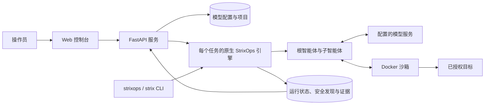
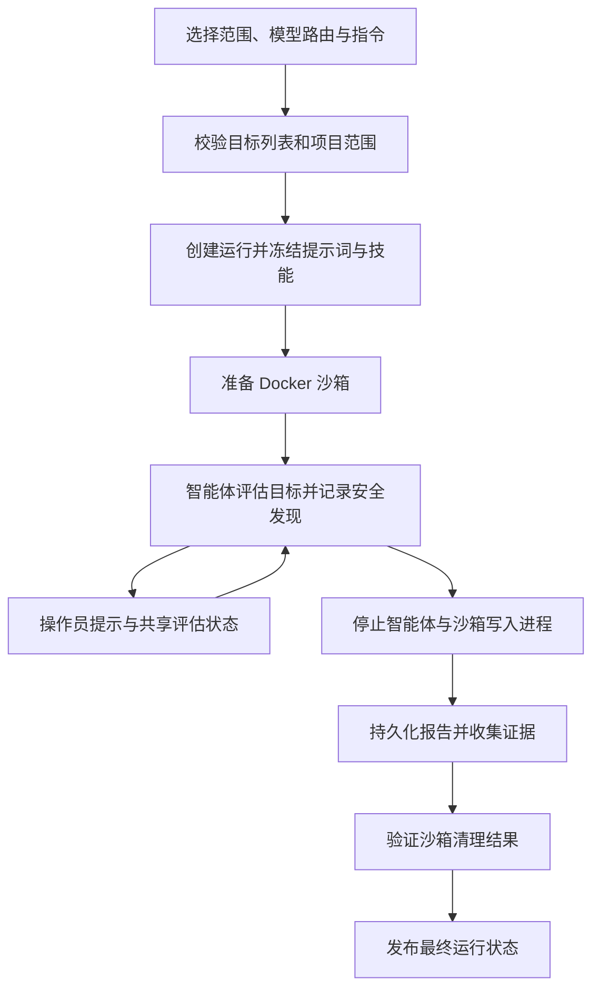

# StrixOps

**面向 Web 应用与内网的安全评估引擎及 Web 控制台。**

**简体中文** · [English](README.md)

版本 **1.1.8** · [版本说明](docs/v1.1.8.md) · [更新日志](CHANGELOG.md) · [Apache-2.0](LICENSE)

StrixOps 将模型驱动的智能体、基于 Docker 的评估工具、实时任务监控、安全发现和证据管理整合到同一工作流程。你可以从浏览器或 CLI 启动评估，跟踪智能体活动，在执行中补充操作指引，并结合原始记录审阅最终报告。

Python 引擎、FastAPI 服务与 Next.js 控制台共同组成完整产品。控制台为每个 Web／内网任务启动一个原生引擎进程；`strixops` 和兼容命令 `strix` 均调用该引擎，无需额外安装 Strix 源码或 Python 包。沙箱镜像基于上游 Strix 镜像扩展，详情见[沙箱部署](#sandbox-deployment)和 [NOTICE](NOTICE)。

请仅对已获得授权的系统使用 StrixOps。模型输出和报告中的覆盖范围需要人工复核；任务完成并不代表目标已经安全。

## 目录

- [功能概览](#what-you-can-do)
- [MCP 流量工作台](#mcp-traffic-workbench)
- [架构与任务生命周期](#architecture-and-task-lifecycle)
- [运行要求](#requirements)
- [从源码快速启动](#quick-start-from-source)
- [安装已构建的 wheel](#install-a-built-wheel)
- [配置模型路由](#configure-model-routes)
- [开始首次评估](#run-your-first-assessment)
- [CLI 用法](#cli-usage)
- [服务器部署](#server-deployment)
- [沙箱部署](#sandbox-deployment)
- [配置参考](#configuration-reference)
- [报告、证据与存储](#reports-evidence-and-storage)
- [提示词、技能与智能体行为](#prompts-skills-and-agent-behavior)
- [故障排查](#troubleshooting)
- [开发与打包](#development-and-packaging)
- [许可证与署名](#license-and-attribution)

<a id="what-you-can-do"></a>

## 功能概览

| 领域 | 已提供的能力 | 实际用途 |
|---|---|---|
| Web 评估 | URL、域名和 IP 目标；浏览器与 HTTP 工具；沙箱内的 Caido 流量拦截 | 分析应用行为，记录可复现的安全发现 |
| 内网评估 | 主机、IP 和 CIDR 目标；共用网络工具镜像；可选 SOCKS5 或 GSocket 接入 | 在明确范围与接入说明的前提下评估已授权内网 |
| MCP 流量工作台 | 独立代理任务、网站捕获范围、请求查看与重放、选定请求的 Agent 测试及 Markdown 报告 | 捕获浏览器流量，针对观察到的页面与 API 测试并保存证据 |
| 多目标任务 | 单次运行最多包含 100 个不同目标 | 为相关服务共用上下文、证据归档和最终报告 |
| [实时控制台](docs/task-page.md) | 五个任务页签、代理选择与对话内指令输入、笔记及统一文件浏览 | 跟踪执行、指导选定代理并集中查看结果 |
| 项目管理 | 范围校验、任务分组、报告汇总和技能使用统计 | 组织同一环境的多次评估 |
| 模型配置 | 自定义 OpenAI 兼容路由或 OpenRouter；Web 与内网分别设置模型、API 类型及推理强度 | 无需修改引擎代码即可复用和比较模型配置 |
| 提示词与技能编辑 | 内置 Markdown 资源库、编辑器、预览及每次运行的资源快照 | 维护指令，同时保留历史运行实际使用的资源 |
| 模型诊断 | 工具调用往返测试，以及独立的逐文件提示词测试 | 在启动完整评估前检查路由行为 |
| 共享评估状态 | 覆盖范围、威胁模型、作者与修订历史 | 协调不同智能体的安全发现和评估记录 |
| [任务共享笔记](docs/shared-notes.md) | Web／内网智能体笔记、版本检查、原子追加、修订历史与只读笔记页签 | 在同一任务中复用发现，避免互相覆盖更新 |
| 报告 | 动态测试发现与依赖项发现、CVSS 校验、源码与修复元数据、项目报告 | 结合证据审阅修复细节 |
| 证据管理 | 保留工作区、SHA256 元数据、二进制文件下载和 ZIP 导出 | 保存安全发现与最终报告引用的文件 |

控制台是**单用户应用**，不提供用户账户、租户隔离或身份验证边界。远程部署时，应通过 SSH 隧道或具备身份验证的访问层使用。

<a id="mcp-traffic-workbench"></a>

## MCP 流量工作台

在侧栏打开 **MCP**，创建流量任务、设置允许／排除的网站，然后启动代理。在测试浏览器中，将 HTTP 和 HTTPS 代理设为页面显示的地址。浏览目标后即可查看或重放请求，选择请求交给 Agent 测试，并导出报告。工作台只捕获实际经过代理的网络请求，不会记录所有前端路由或自动遍历整个网站。

MCP 任务拥有独立的捕获容器、短期请求容器和数据目录，默认使用 `~/.strixops/mcp_tasks`，可通过 `STRIXOPS_MCP_ROOT` 配置，与 Web／内网运行分开。请求测试可复用已保存的 Web 模型路由和兼容的提示词／技能资源，每次测试保存资源快照。

同一 MCP 数据目录下的任务共用一张持久 CA，每个测试浏览器／配置文件只需导入并信任一次。重启捕获、创建或删除任务均不会更换 CA。升级时优先沿用有效旧 CA；如果浏览器信任的是另一张旧 CA，需要导入共用 CA。正在运行的旧代理会保留原证书，直到下次启动；升级不会自动重启代理。

长任务名称和 URL 不再撑破列宽，详情保留完整内容。删除任务需确认，随后停止其代理与测试工作，并清除保存的流量、结果和报告；共用 CA 与其他任务继续保留。

通过控制台 IP 打开 MCP 即可自动初始化，沿用控制台部署的访问边界。从远程控制台地址启动代理时，会自动选择代理地址并产生帐密，可在连接信息中显示及复制，不需要手动设置 MCP 环境变量。显式 Token 与代理配置仍保留为高级覆盖选项。

捕获使用独立且固定版本的 mitmproxy 镜像。安装、浏览器信任、范围规则、存储及当前限制见 [MCP 操作指南](docs/mcp-traffic-workbench.md)，升级命令见 [1.1.8 版本说明](docs/v1.1.8.md)。

<a id="architecture-and-task-lifecycle"></a>

## 架构与任务生命周期



构建后的前端与 API 由同一个控制台进程提供，并使用同一来源。评估环境由本地 Docker 守护进程提供；常规部署不需要 Postgres、Redis 或独立的前端服务器。模型服务单独配置，并会接收智能体请求所需的上下文。
此处架构图描述 Web／内网运行；MCP 使用上文所述的独立请求测试生命周期。



失败和正常中断也会进入清理与证据处理流程。强制终止进程或主机故障可能需要操作员进行恢复。只有报告持久化完成且容器清理经过验证后，任务才会被标记为成功完成。

<a id="requirements"></a>

## 运行要求

| 组件 | 要求 | 何时需要 |
|---|---|---|
| 主机操作系统 | Linux 或 macOS / POSIX 环境 | 引擎、CLI 和控制台 |
| Python | 3.12 或更新版本 | 引擎、CLI 和控制台 |
| Docker | 正在运行的 Linux 容器守护进程，且运行 StrixOps 的账户可访问 | 实际评估 |
| 沙箱镜像 | `strixops-sandbox:1.3.0`，或通过 `STRIXOPS_IMAGE` 指定的兼容镜像 | 实际评估 |
| MCP 代理镜像 | 固定 `ghcr.io/mitmproxy/mitmproxy:12.2.3`，完整 digest 见 [MCP 指南](docs/mcp-traffic-workbench.md#安裝與啟動) | MCP 捕获与请求重放 |
| 模型服务 | 支持所选协议、流式响应及函数工具的 OpenAI 兼容 API | 评估和模型诊断 |
| Git 与 uv | 获取源码并按照锁定依赖安装 Python 环境 | 源码部署 |
| Node.js 与 npm | 当前锁定的前端依赖要求 Node.js 20.9+ | 仅构建前端源码时需要 |
| 网络与磁盘 | 能访问模型服务、已授权目标及镜像和构建源，并有足够空间保存工作区与证据 | 取决于评估任务 |

主机运行控制台与 Python 引擎，评估工具运行在 Docker 沙箱中。镜像内可用工具可能因 CPU 架构而异。部分可选内网工具仅尽力安装；如果评估依赖某个特定工具，请先检查镜像。

控制台使用 `fcntl` 等 POSIX 功能，当前实现不支持在原生 Windows 环境中运行。Windows 用户需要使用能够访问 Docker 且支持兼容工作区绑定挂载的 Linux 环境。

<a id="quick-start-from-source"></a>

## 从源码快速启动

在已安装 Git、uv、Node.js/npm 和 Docker 的终端中执行：

```bash
git clone --branch v1.1.8 https://github.com/0xG1w4/StrixOps.git
cd StrixOps

npm --prefix console/web ci
npm --prefix console/web run build
uv sync --frozen --no-dev
bash containers/build-images.sh

uv run --no-dev strixops-console --runs-root "$PWD/strix_runs"
```

打开 **[http://127.0.0.1:8300](http://127.0.0.1:8300)**。

请在 `uv sync` 之前构建前端：Python 包会包含 `console/web/out`，而刚克隆的源码中尚无该目录，需先完成前端构建才能生成。

1. 打开**设置**，创建模型配置，填写供应商 URL、API Key，以及 Web 和内网模型。
2. 选择 API 模式与推理强度，然后使用**测试模型**检查流式工具调用和工具结果处理流程。
3. 打开扫描启动界面，填写已授权目标和指令，然后启动任务。
4. 在运行详情页查看对话、智能体、安全发现、报告和证据。

请像示例一样使用**绝对运行目录路径**。控制台使用自身的工作目录启动引擎进程；相对运行路径在控制台和引擎中可能解析为不同位置，wheel 安装方式尤其需要注意。

上面的克隆命令选择 `v1.1.8` **发布标签**，以 detached HEAD 状态打开该版本的精确快照，不是持续维护的发布分支。在已有仓库中，该标签的完整引用为 `refs/tags/v1.1.8`。

安装完成后，再次启动只需执行：

```bash
cd /path/to/StrixOps
uv run --no-dev strixops-console --runs-root "$PWD/strix_runs"
```

可以使用健康检查验证控制台服务；该操作不会启动扫描或请求模型：

```bash
curl --fail http://127.0.0.1:8300/api/health
```

健康检查端点不会验证 Docker、模型密钥或目标可达性。

<a id="install-a-built-wheel"></a>

## 安装已构建的 wheel

wheel 包包含已构建的控制台和运行时提示词、技能资源库，**不包含** Docker 沙箱镜像。如果你已持有可信的 `strixops-1.1.8-py3-none-any.whl`，可以采用此方式。以下步骤不假定包已发布至 PyPI，也不假定 GitHub Release 已上传安装文件。自行构建的方法见[打包](#packaging)。

```bash
python3 -m venv .venv
.venv/bin/python -m pip install ./strixops-1.1.8-py3-none-any.whl
.venv/bin/strixops --version
.venv/bin/strixops-console --runs-root "$PWD/strix_runs"
```

运行该 wheel 不需要 Node.js。请使用匹配源码版本的 `containers/` 文件构建沙箱，或另行准备兼容镜像。服务账户需要访问 Docker，并对状态目录具有写入权限。通过控制台编辑提示词或技能时，还需要对已安装包的资源目录具有写入权限。

<a id="configure-model-routes"></a>

## 配置模型路由

每个配置包含一个供应商 URL 和 API Key，并分别为 Web 与内网任务指定模型。如果其中一类任务未设置模型，会一并继承另一类任务的模型、API 类型和推理强度。

| 选项 | StrixOps 行为 |
|---|---|
| 自定义路由 | 使用填写的 OpenAI 兼容 Base URL、API Key 和模型 ID |
| OpenRouter | 使用内置 OpenRouter 端点，以及供应商目录中的模型 ID |
| `Chat Completions` | 向 Base URL 下的 `/chat/completions` 端点发送 Chat Completions 格式请求 |
| `Responses` | 向 Base URL 下的 `/responses` 端点发送 Responses 格式请求 |
| `Auto` | 根据 StrixOps 内置的模型名称规则选择协议，不会探测或协商支持情况 |
| `Provider default` 推理强度 | 不覆盖供应商的推理强度设置 |
| `none` 推理强度 | 显式发送该值，与省略参数不同 |
| 复制 | 打开新的配置草稿；只有供应商和端点相同时才会复用已保存的密钥 |
| 测试模型 | 使用一个无害函数及其返回结果，发送两次简短的流式请求 |

例如，Base URL 为 `https://gateway.example/v1` 时，请求地址为 `https://gateway.example/v1/chat/completions` 或 `https://gateway.example/v1/responses`。请填写 API 基础地址，而非完整的 completion 端点，并使用该网关实际识别的模型 ID。

当前版本中，Auto 会为已识别的 Astra、GPT-5.4 Pro、GPT-5.5 和 GPT-5.6 名称选择 Responses，其他名称使用 Chat Completions。使用部署别名时，请明确设置 API 类型。手动选择的 API 会被保留，原生模型兼容性说明仅作提示；不支持的选项值和已知不支持的推理强度仍会被拒绝。请求最终能否成功，取决于供应商的实际支持。

两种模式均使用 OpenAI 兼容格式，但网关可能只实现其中一种，也可能只支持部分工具、图片和推理设置。模型出现在目录中，并不代表该组合可用。请求失败时，不会静默切换 API、推理强度或模型。模型测试会正常消耗供应商配额。

新建控制台配置默认使用 Auto。CLI 未设置 `LLM_API_MODE` 时，为保持向后兼容，仍使用 Chat Completions。CLI 环境变量与控制台保存的配置相互独立；通过控制台启动任务时，请先保存模型配置。

<a id="run-your-first-assessment"></a>

## 开始首次评估

| 步骤 | 需要填写或检查的内容 |
|---|---|
| 1. 范围 | Web 或内网任务类型、已授权目标，以及可选项目 |
| 2. 接入 | 相关凭据与接入说明；按需填写内网隧道设置 |
| 3. 指令 | 评估目标、边界、排除项及报告语言 |
| 4. 路由 | 已保存的模型配置，以及对应的 Web 或内网模型设置 |
| 5. 执行 | 实时对话、智能体树、覆盖记录、安全发现和操作员提示 |
| 6. 审阅 | 最终报告、发现详情、尚未完成的覆盖项及证据交付状态 |

控制台默认使用单目标表单。**多目标任务**会创建一次原生运行，而非多个独立扫描组成的队列。

| 限制 | 控制台 | CLI |
|---|---|---|
| 目标数量 | 单目标模式为 1 个；多目标模式为 2–100 个 | 1–100 个不同目标 |
| 文本导入 | UTF-8 `.txt`，最大 512 KiB | `--target-list`，每个文件最大 1 MiB |
| 目标长度 | 最多 2,048 个字符 | 最多 2,048 个字符 |
| 标准化处理 | 忽略空行和整行 `#` 注释；合并完全相同的重复项 | 相同 |
| 共用设置 | 同一任务类型、模型路由和指令集 | 相同 |

所有目标共用智能体上下文、评估状态、证据和最终报告。任务启动时，会再次对完整目标列表进行项目范围校验。重新运行、搜索和报告汇总也会保留该列表。导入目标不会同时准备源码仓库或 API 规范文件。

<a id="cli-usage"></a>

## CLI 用法

CLI 从环境变量读取模型配置。执行以下示例前，请将占位内容替换为你自己的路由和已授权实验目标：

```bash
export LLM_API_BASE="https://gateway.example/v1"
export LLM_API_KEY="YOUR_API_KEY"
export STRIX_LLM="YOUR_MODEL_ID"
export LLM_API_MODE="auto"
export LLM_REASONING_EFFORT="default"
export STRIX_RUNS="$PWD/strix_runs"

uv run --no-dev strixops \
  --target https://app.lab.example \
  --scan-type web \
  --instruction-file ./engagement.md \
  --report-language en
```

多个目标及列表文件中的目标会合并为同一个有序范围：

```bash
uv run --no-dev strixops \
  -t https://app.lab.example \
  -t https://api.lab.example \
  --target-list ./targets.txt \
  --instruction-file ./engagement.md
```

内网任务示例：

```bash
uv run --no-dev strixops \
  --target 192.0.2.10 \
  --scan-type internal \
  --socks5 socks5://proxy.lab.example:1080 \
  --instruction-file ./engagement.md
```

`192.0.2.10` 和 `proxy.lab.example` 是文档占位内容。SOCKS5 地址必须能从 Docker 沙箱访问；仅绑定主机回环地址的代理，不会自动变得可从容器访问。请将示例替换为实际可达的代理地址。隧道提供网络访问能力，本身不会建立远程 shell。

| 参数 | 用途 |
|---|---|
| `-t`、`--target` | 添加目标，可重复使用 |
| `--target-list` | 从 UTF-8 文件添加目标，可重复使用 |
| `--scan-type web\|internal` | 选择评估工作流程 |
| `--instruction-file` | 从 Markdown 文件加载操作员指令 |
| `--instruction` | 未提供指令文件时，使用此内联指令 |
| `--socks5` / `--gsocket` | 选择内网接入设置，两者不能同时使用 |
| `--crypto` | 启用可选的内网加密资产评估重点 |
| `--report-language en\|zh-CN` | 选择报告和安全发现的语言，默认 `zh-CN` |
| `--version`、`--help` | 查看已安装版本和 CLI 参数 |

使用 wheel 安装时，将 `uv run --no-dev strixops` 替换为 `.venv/bin/strixops`。运行成功时退出码为 `0`；失败时返回非零退出码，详情保存在运行目录中。当前没有恢复运行命令；重新运行会开始一次新的评估。

<a id="server-deployment"></a>

## 服务器部署

### Linux 服务

以下是部署目录示例，并非随项目提供的安装程序：

| 路径 | 内容 |
|---|---|
| `/opt/StrixOps` | 源码、已安装的 `.venv` 和构建后的控制台 |
| `/var/lib/strixops/console.json` | 模型配置及集成设置 |
| `/var/lib/strixops/projects.json` | 项目元数据 |
| `/var/lib/strixops/project_reports` | 项目汇总报告 |
| `/var/lib/strixops/runs` | 运行状态、安全发现、工作区和证据 |

准备 `strixops` 服务账户，按照快速启动步骤在 `/opt/StrixOps` 安装并构建源码，确保该账户可写入这些目录。根据主机的管理策略授予其 Docker 守护进程访问权限。Docker 访问权限属于主机特权访问。如果使用控制台编辑器，该账户还需要对 `src/strixops/agents/prompt_parts` 和 `src/strixops/skills/content` 具有写入权限。

将以下内容保存为 `/etc/systemd/system/strixops-console.service`：

```ini
[Unit]
Description=StrixOps Console
Wants=network-online.target
After=network-online.target docker.service

[Service]
Type=simple
User=strixops
Group=strixops
WorkingDirectory=/opt/StrixOps
Environment=HOME=/var/lib/strixops
Environment=STRIXOPS_CONSOLE_CONFIG=/var/lib/strixops/console.json
Environment=STRIXOPS_PROJECTS_FILE=/var/lib/strixops/projects.json
Environment=STRIXOPS_PROJECT_REPORTS_DIR=/var/lib/strixops/project_reports
ExecStart=/opt/StrixOps/.venv/bin/strixops-console --host 127.0.0.1 --port 8300 --runs-root /var/lib/strixops/runs
Restart=on-failure
RestartSec=5
TimeoutStopSec=300
UMask=0077

[Install]
WantedBy=multi-user.target
```

启用服务并查看日志：

```bash
sudo systemctl daemon-reload
sudo systemctl enable --now strixops-console
sudo systemctl status strixops-console
sudo journalctl -u strixops-console -f
```

上面的超时值仅为部署示例，不保证所有清理工作都能在五分钟内完成。计划重启服务、升级或关闭主机前，请先通过控制台停止活动任务，并等待收尾完成。

### 远程访问

保留默认的回环监听地址，从工作站建立 SSH 隧道：

```bash
ssh -N -L 18300:127.0.0.1:8300 user@your-server
```

然后在本机打开 [http://127.0.0.1:18300](http://127.0.0.1:18300)。如果改用反向代理，请在该层配置身份验证和 TLS，同时转发 UI 与 `/api/*`，并支持不经缓冲的长连接流式响应。请勿将 `--host 0.0.0.0` 直接暴露为没有身份验证的公共服务。

### 备份与升级

1. 停止活动评估，等待证据处理和清理完成。
2. 备份运行目录，以及上面列出的控制台、项目和报告设置路径。
3. 备份源码或已安装包中修改过的提示词与技能文件；包升级或源码切换可能覆盖这些修改。
4. 更新到目标分支或安装目标 wheel。更新源码时，依次重新执行 `npm --prefix console/web ci`、`npm --prefix console/web run build` 和 `uv sync --frozen --no-dev`。
5. 沙箱 Dockerfile、基础镜像或所选镜像发生变化时，重新构建沙箱。
6. 重启控制台并检查 `/api/health`，然后验证模型路由，再开始下一次评估。

运行快照保留历史提示词和技能输入，不会自动还原可编辑资源库，也不会恢复已停止的扫描。请妥善保护备份：设置中包含供应商凭据，评估输出中可能包含敏感证据。

<a id="sandbox-deployment"></a>

## 沙箱部署

Web 和内网任务使用同一个默认镜像：

| 层次 | 镜像或行为 |
|---|---|
| 上游基础镜像 | `ghcr.io/usestrix/strix-sandbox:1.3.0` |
| StrixOps 镜像 | `strixops-sandbox:1.3.0` |
| 扩展内容 | 内网工具、隧道工具、工作区布局及工具路径 |
| Web 工作流程 | 启用 Caido 代理拦截 |
| 内网工作流程 | 禁用 Caido，并应用指定的隧道设置 |

在 Docker 主机上构建并检查镜像：

```bash
bash containers/build-images.sh
docker image inspect strixops-sandbox:1.3.0
```

保留当前上游基础镜像，同时使用自定义本地标签：

```bash
BASE_IMAGE=ghcr.io/usestrix/strix-sandbox:1.3.0 \
  bash containers/build-images.sh custom
export STRIXOPS_IMAGE="strixops-sandbox:custom"
```

脚本的位置参数标签也会决定默认的上游基础镜像标签，因此当本地标签与上游标签不同时，请显式设置 `BASE_IMAGE`。如果使用自行维护的兼容仓库镜像，请在控制台或 CLI 环境中将 `STRIXOPS_IMAGE` 设为该镜像引用。镜像名称为 `strixops-sandbox` 时，StrixOps 要求先在本地构建；其他已配置但本地缺失的镜像会通过 Docker 拉取。需要提前配置好镜像仓库访问权限与身份验证。

仓库提供的是**沙箱 Dockerfile**，并非完整的控制台 Docker/Compose 部署方案。wheel 和前端构建都不会构建或打包沙箱镜像。实际工具清单及不同架构下的尽力安装项，请查阅 [Dockerfile](containers/Dockerfile.sandbox)。

请使用能够绑定挂载引擎工作区路径的 Docker 守护进程。仅设置远程 `DOCKER_HOST`，不会让本地工作区目录自动出现在远程主机上。产品版本 `1.1.8` 与沙箱标签 `1.3.0` 是各自独立的版本号。

<a id="configuration-reference"></a>

## 配置参考

### 模型与持久化状态

| 变量 | 默认值或含义 |
|---|---|
| `LLM_API_BASE` | CLI 评估必填；API 基础地址 |
| `LLM_API_KEY` | CLI 评估必填；供应商凭据 |
| `STRIX_LLM` | CLI 评估必填；路由的模型 ID |
| `LLM_API_MODE` | `chat_completions`；也接受 `auto` 和 `responses` |
| `LLM_REASONING_EFFORT` | `default`；可选值包括 `none`、`minimal`、`low`、`medium`、`high`、`xhigh`、`max`，具体取决于模型支持情况 |
| `STRIX_RUNS` | `<current working directory>/strix_runs`（当前工作目录下）；建议使用绝对路径；控制台 `--runs-root` 优先 |
| `STRIXOPS_CONSOLE_CONFIG` | `~/.strixops/console.json` |
| `STRIXOPS_PROJECTS_FILE` | `~/.strixops/projects.json` |
| `STRIXOPS_PROJECT_REPORTS_DIR` | `~/.strixops/project_reports` |
| `STRIXOPS_IMAGE` | 两种扫描类型均默认为 `strixops-sandbox:1.3.0` |
| `STRIX_HOST_WORKSPACE_DIR` | 可选，由操作员指定的工作区绑定挂载；未设置时使用每次运行保留的工作区 |
| `STRIX_OPERATOR_HINTS_DIR` | 可选的提示目录；控制台启动时会提供本次运行专属的路径 |
| `STRIXOPS_REPORT_LANG` | `zh-CN`；CLI `--report-language` 优先 |
| `STRIXOPS_REPORT_SYNTHESIS` | 默认启用；设为 `0` 可禁用模型辅助的最终报告合成 |
| `PERPLEXITY_API_KEY` | 可选的网络搜索密钥；可在控制台“设置 → 集成”中保存 |
| `PERPLEXITY_ENABLED` | 搜索开关；默认 true，仍需密钥才能使用 |
| `PERPLEXITY_MODEL` | `sonar`（默认）或 `sonar-reasoning-pro` |
| `PERPLEXITY_TIMEOUT_SECONDS` | 搜索超时 10–300 秒；按模型默认 30 / 300 秒 |

CLI 读取环境变量，不会自动读取项目中的 `.env` 文件。控制台在服务端保存模型配置，在 API 返回值中掩码显示密钥；设置文件以 `0600` 权限保存。掩码显示不等于静态加密存储。

Perplexity 设置、连接测试、任务用量及搜索不可用时的继续执行行为见[网络搜索指南](docs/web-search.md)。

### 智能体与上下文限制

| 变量 | 默认值 | 控制内容 |
|---|---|---|
| `STRIXOPS_AGENT_MAX_DEPTH` | `2` | 最大委派深度；根智能体深度为 0 |
| `STRIXOPS_AGENT_MAX_ACTIVE` | `4` | 同时活动的智能体数量 |
| `STRIXOPS_AGENT_MAX_TOTAL` | `12` | 整次运行的智能体总数，包括根智能体 |
| `STRIX_CONTEXT_AUTO_COMPACT` | `true` | 自动压缩对话上下文 |
| `STRIX_CONTEXT_BUFFER_TOKENS` | `20000` | 上下文预留 token 数 |
| `STRIX_CONTEXT_KEEP_TOKENS` | `8000` | 压缩时保留的近期历史 token 数 |
| `STRIX_CONTEXT_FALLBACK_TOKENS` | `200000` | 无模型元数据时使用的上下文上限 |
| `STRIX_CONTEXT_SUMMARY_TOKENS` | `4096` | 摘要输出 token 预算 |
| `STRIX_TOOL_OUTPUT_MAX_TOKENS` | `8000` | 工具输出 token 预算 |
| `STRIX_TOOL_OUTPUT_MAX_LINES` | `2000` | 工具输出行数上限 |
| `STRIX_TOOL_OUTPUT_MAX_BYTES` | `51200` | 工具输出字节上限 |
| `STRIX_MAX_CONTEXT_IMAGES` | `3` | 保留的近期图片输出数量 |

这些限制**不是费用预算**。上下文压缩、安全发现去重、报告合成和诊断也会调用模型。缺少模型元数据时，请将备用上下文上限设为实际模型的容量。

<a id="reports-evidence-and-storage"></a>

## 报告、证据与存储

每个任务都会在耗时初始化之前创建 `<runs-root>/<slug>_<4hex>/`。即使沙箱或模型在早期失败，控制台也能显示启动错误。

```text
<run>/
├── run.json                      运行元数据与状态
├── events.jsonl                  结构化生命周期与智能体事件
├── engine.log                    控制台启动的引擎 stdout/stderr
├── assessment.json               共享覆盖范围与威胁模型状态
├── penetration_test_report.md    最终评估报告
├── vulnerabilities.json / .csv   结构化漏洞发现
├── vuln-NNNN.md                  单项漏洞记录
├── internal_findings/            内网评估发现
├── evidence/                     归档证据文件与交付元数据
├── workspace/                    默认保留的沙箱工作区
├── operator_hints/               运行期间提供的操作指引
└── .state/
    ├── agents.db                 各智能体的对话会话
    ├── agents.json               智能体状态
    ├── prompt_resources.json     冻结的提示词与技能内容
    ├── prompt_manifest.json      资源哈希
    └── prompt_*.md               智能体提示词快照
```

文件是否生成取决于任务进展和输出，并非每次运行都会产生所有文件。操作员指定的工作区会替代默认工作区位置。事件和产物的具体约定见[平台代码](src/strixops/platform)。

- 安全发现会校验 CVSS 指标，并分别保留动态测试发现及依赖项上下文。后者包括包名与版本、清单文件、安全公告评分、可达性证据、源码位置和修复详情。
- 最终报告合成使用配置的模型、已记录的安全发现、评估状态及收尾叙述。合成失败或被禁用时，回退为确定性的报告组装。
- 捕获证据前会停止智能体和沙箱写入进程。复制文件时以流式方式计算 SHA256，没有固定的 50 MiB 截断限制；工作区原文件与归档副本可能同时占用磁盘空间。
- 缺失引用、复制失败、符号链接和特殊文件会被记录为交付不完整，不会标记为已交付。审阅报告时，请同时检查证据交付状态。
- 覆盖范围由智能体报告。没有评估记录的旧运行会显示覆盖范围未知；任务完成且未发现问题，并不代表完整覆盖。

<a id="prompts-skills-and-agent-behavior"></a>

## 提示词、技能与智能体行为

### 编辑与一致性

**技能**页面列出系统提示词片段和技能 Markdown 文件，可在此编辑、预览和保存。修改影响**后续运行**；正在执行的任务及其子智能体使用该次运行冻结的资源快照，不受之后资源库编辑的影响。内置提示词位于 [prompt_parts](src/strixops/agents/prompt_parts)，技能位于 [skills/content](src/strixops/skills/content)。

子智能体会收到明确的范围与任务，并可在配置限制内继续委派。共享覆盖范围和威胁模型工具保留修订记录与作者信息。子智能体继承父级上下文时获得的是快照，不会实时收到父级后续消息。只有成功调用生命周期工具，才能完成一个智能体。

每个智能体都有独立的对话会话。上下文压缩会保留近期历史，并保持工具调用与结果的对应关系；上下文溢出时，每个周期最多触发两次强制压缩。超大的工具输出会显示预览，存储成功时，完整内容保存在 `/workspace/.tool-output/`。使用图片需要模型路由支持图片输入。

### 提示词诊断与路由诊断

| 检查方式 | 输入与行为 | 结果能说明什么 |
|---|---|---|
| 设置 → 测试模型 | 使用无害函数及其返回结果，发送两次简短的流式请求 | 该路由能否完成本次测试的工具调用往返流程 |
| 技能 → 提示词测试 | 对每个选中的已保存文件分别发送一次流式请求，将文件原样用作系统指令，将必填的测试任务用作用户消息；不提供工具 | 该文件、任务和路由组合下实际观察到的回复或拒绝行为 |

提示词测试不会组装完整扫描提示词，也不会展开模板变量。结果会区分普通回复、结构化拒绝、明确的策略拦截、供应商错误和无法确定的情况。**未观察到拒绝**仅表示未检测到拒绝信号；请阅读回复来判断任务是否完成。片段测试通过，不能预测完整评估是否会被接受。

对话框支持进度显示与取消，并记录任务、回复、源文件与任务哈希、路由、模型、API、推理强度及时间。回复会进行凭据脱敏；超过 32,768 字符的显示上限时，会明确标记截断。结果仅保留在当前对话框会话中。修改文件或路由后，请刷新目录。遇到明确的 `cyber_policy` 结果时，剩余批次会停止；仅打开对话框不会请求模型。

项目技能统计会计入已记录的动态加载和显式智能体注入事件。概览先展示五项，可展开完整列表。计数不衡量技能效果，也不代表所有自动预加载情况。

<a id="troubleshooting"></a>

## 故障排查

| 现象 | 检查或处理方法 |
|---|---|
| 控制台可访问，但 UI 缺失或仍是旧版 | 执行 `npm --prefix console/web run build` 重新构建 `console/web/out`，并使用 `strixops-console` 提供静态导出文件 |
| 提示词保存返回 404 | 更新到包含 `PUT` 保存修复的版本，并刷新浏览器；提示词和技能写入均使用 `PUT` |
| wheel 安装后无法保存提示词或技能 | 检查已安装包资源目录的写入权限 |
| 任务出现在另一个运行目录 | 使用绝对 `--runs-root`，并检查控制台报告的根目录 |
| 缺少沙箱镜像 | 构建 `strixops-sandbox:1.3.0`；确认控制台账户访问的是同一个 Docker 守护进程和镜像 |
| Docker 连接或 socket 错误 | 确认 Docker 正在运行且服务账户可访问，并查看底层守护进程错误 |
| 模型出现在列表中，但任务立即失败 | 测试完全相同的路由、模型、API 和推理强度组合；仅能列出模型并不足够 |
| Chat 请求拒绝同时使用工具与推理 | 检查上游模型和网关支持的组合，然后明确配置兼容的 API 与推理强度 |
| `Response API in-stream error` | 查看运行日志中的安全错误码、请求 ID 和网关 ID，并与供应商日志关联排查 |
| 明确的 `cyber_policy` 拒绝 | 与供应商核对实际上游 API 组织或项目的授权；更改协议或推理强度不会授予访问权限 |
| 未知模型触及上下文上限 | 将 `STRIX_CONTEXT_FALLBACK_TOKENS` 设为该模型的容量，并检查压缩设置 |
| 覆盖范围或附件不完整 | 检查评估记录、交付记录和保留工作区；不要仅凭完成状态判断完整性 |
| 通过代理访问时实时更新停滞 | 检查访问层的流式响应支持、缓冲和空闲超时 |

重试次数有上限，且仅适用于符合条件的暂时性故障。通用的流式 `500` 可能掩盖更具体的上游拒绝；输出开始后的错误和明确的策略拒绝不会自动重放请求。

<a id="development-and-packaging"></a>

## 开发与打包

### 仓库结构

```text
src/strixops/
├── cli.py          CLI 参数与退出码
├── config/         模型路由、推理与上下文设置
├── platform/       运行命名、事件、产物与提示
├── engine/         编排、智能体、会话与生命周期
├── agents/         智能体工厂与提示词片段
├── tools/          智能体函数工具
├── report/         安全发现、报告状态与合成
├── runtime/        Docker 沙箱集成
├── skills/         内置技能资源库与注册表
└── console/        FastAPI 控制台服务
console/web/        Next.js 前端，导出为静态文件
containers/         沙箱 Dockerfile 与构建脚本
docs/               发布文档
```

开发前端时，分别启动 API 和 Next 开发服务器：

```bash
# 终端 1，在仓库根目录执行
uv run --no-dev strixops-console --runs-root "$PWD/strix_runs"

# 终端 2，在仓库根目录执行
npm --prefix console/web run dev
```

开发 UI 使用端口 `3100`，并从浏览器请求 `http://127.0.0.1:8300`。请使用本地浏览器，或同时转发这两个端口。生产环境通过控制台提供静态导出文件；`npm start` 不会启动 Next 生产服务器。修改前端后，需重新构建才能在生产控制台中使用。

<a id="packaging"></a>

### 打包

请**先构建前端**，再构建 Python 分发包，以便 Hatch 将前端文件一并打包：

```bash
npm --prefix console/web ci
npm --prefix console/web run build
uv sync --frozen --no-dev
uv build
```

产物写入 `dist/`。wheel 将前端打包到 `strixops/console/web`，同时包含运行时提示词和技能文件。源码分发包还包含前端源码、容器构建文件和文档。Docker 镜像仍需单独部署。

运行时依赖由 [pyproject.toml](pyproject.toml) 和锁定的 [uv.lock](uv.lock) 定义；前端依赖使用 [package-lock.json](console/web/package-lock.json)。本仓库未提供发布 CI 工作流程。内部回归测试集、脚本化测试数据和验证记录不包含在公开仓库或分发包中；凭据、扫描输出和本地开发指令也不包含在内。

<a id="license-and-attribution"></a>

## 许可证与署名

StrixOps 使用 [Apache License 2.0](LICENSE) 许可证。部分资源和行为源自开源 [Strix](https://github.com/usestrix/strix) 项目，包括技能内容，以及提示词、上下文和沙箱设计的部分实现。署名范围见 [NOTICE](NOTICE)。上游沙箱镜像及其安装的工具保留各自的许可证与分发要求。
