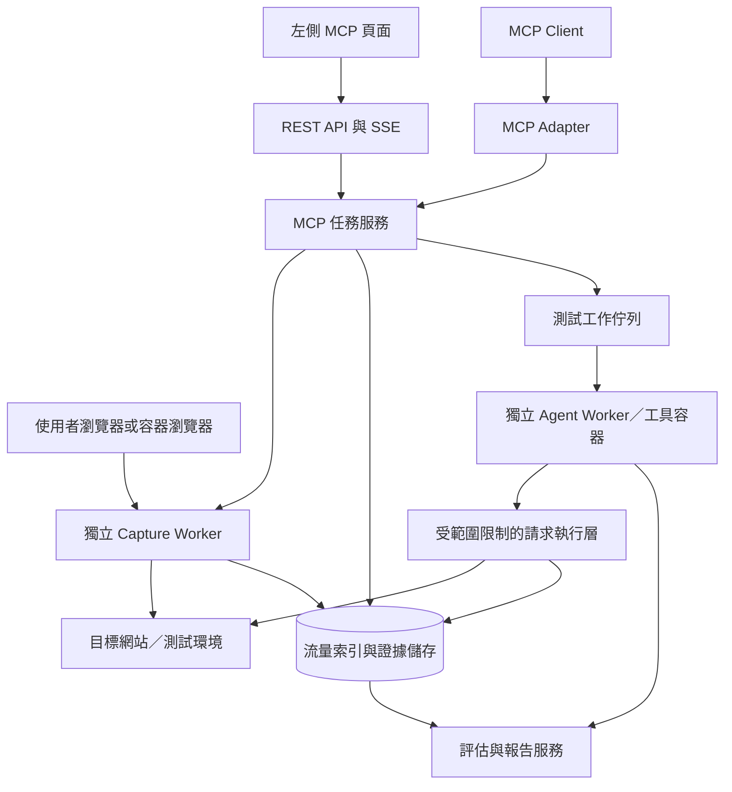

# MCP 流量工作台需求評估

評估日期：2026-09-10。第一版已依此方向實作並以本機 fixture 驗證，後續已加入平台共用持久 CA、任務刪除與長網址版面修正。本文保留完整需求與後續方向；實際安裝、操作及第一版限制以 [操作指南](mcp-traffic-workbench.md) 為準。

## 已確認的產品方向

- 左側功能列新增 **MCP**，管理獨立 MCP 任務；不掛在既有 Web／Internal 任務或 Projects 分頁下。
- MCP 頁面可以新增 MCPTask。每個任務保存自己的已捕獲頁面、API、request／response、測試紀錄、results、findings 與報告；停止監聽或清理容器後仍保留。
- 每個執行中的 MCPTask 使用專屬代理容器；MCP 測試的工具容器也歸該任務所有，不共用 Web／Internal 任務的執行中容器、工作資料或生命週期。
- 每個 MCPTask 可以設定只捕獲哪些網站的流量。以明確的網站允許／排除規則控制保存範圍；Agent 可測試範圍另外受執行政策限制。
- 第一版包含啟停監聽、捕獲、檢視、重送、選取 request 交給 Agent 測試，以及產生報告。
- 暫停請求、人工修改再放行的 Intercept queue 不在第一版。
- 第一版使用自己的瀏覽器手動設定 Proxy；平台提供的容器瀏覽器列為後續能力。

**評估結論：可行，但工作量主要在獨立任務生命週期、流量持久化、身份與請求上下文、測試證據關聯，並非新增幾個 MCP tools。**

MCP 是讓 Agent 呼叫功能的協定；實際 HTTP(S) 流量由代理程序處理。前端頁面命名為 MCP，內部第一個任務類型為流量分析即可。啟用 MCP 連線與開始捕獲分成兩個狀態；由「開始監聽」或對應 tool 明確啟動代理，避免每次 MCP client 重連就產生新任務。[MCP 架構](https://modelcontextprotocol.io/specification/2025-11-25/architecture)

## 現有程式可以沿用什麼

| 能力 | 現況與整合判斷 |
|---|---|
| 代理 | `src/strixops/runtime/caido.py` 已有 Caido 啟動與 GraphQL client；`runtime/sandbox.py` 管理 Docker sandbox。 |
| Agent tools | `src/strixops/tools/proxy.py` 已有 list/view/repeat request、sitemap 與 scope，共六個內建 function tools；目前不是 MCP server。 |
| 前端 | Next.js 15／React，靜態匯出後由 FastAPI 服務。`console/web/src/components/Shell.tsx` 是新增左側 MCP 入口的位置。 |
| 即時資訊 | `src/strixops/console/server.py` 已有 SSE；目前 `/api/runs/{name}/proxy` 只有代理健康彙總，沒有完整流量查閱 API。 |
| 報告 | `report/assessment.py`、`report/synthesis.py`、`tools/reporting.py` 有評估結果、證據與報告組件；可抽取共用能力。 |
| 現有限制 | Caido 建立 `temporary=True` project，run 結束後 sandbox 會清理；目前不能直接承擔長期流量工作台。 |

新任務應有獨立儲存與服務，不透過 `/api/scans` 建立 Web scan。共用 Agent runtime、工具契約、報告 renderer 或 Docker ownership 元件時，也要移除對 web run／`services.sandbox.caido` 的硬性依賴。現有專案報告只納入既有完成任務，不能直接套用成 MCP 任務報告。

既有 replay 回傳契約也需升級：`tools/caido_api.py` 目前將 response headers 轉為字典、本文以 UTF-8 解碼並截到 8192 字元，且 replay 重建為 HTTP/1.1。因此可沿用呼叫流程，但完整證據要另外保存，不能拿目前的 Agent 摘要回傳當成原始流量檔。

## 操作與介面

入口是 **MCP 任務列表 → 新增任務 → 任務工作台**。任務列表呈現任務名稱、監聽狀態、最近流量、已觀察端點與測試進度，與 Web／Internal 列表分開。

新增任務表單包含名稱、允許捕獲的網站、排除規則與代理連接設定。可提供「建立並開始監聽」按鈕，讓一次操作完成任務建立與專屬代理啟動。開啟 MCP 頁面本身只顯示任務列表，不自動建立容器；每次新的捕獲都必須歸屬一個已保存的 MCPTask。

任務與監聽的操作定義：

| 操作 | 容器與資料行為 |
|---|---|
| 建立並開始監聽 | 建立 MCPTask、CaptureSession 與該任務專屬代理容器，顯示 Proxy 地址。 |
| 停止監聽 | 停止接入並完成已接收資料的保存，關閉代理容器；已存流量、測試結果與報告保留。 |
| 繼續捕獲 | 在既有任務下建立新的 CaptureSession 與代理容器，保留各次捕獲的來源與時間。 |
| 結束 MCP 任務 | 停止捕獲、取消該任務仍在執行的測試並清理所屬容器；任務保留供查閱。需要再執行時須明確重新開啟任務。 |
| 關閉頁面／MCP client 斷線 | 不改變任務、代理或測試容器的執行狀態。 |
| 刪除任務資料 | 獨立於停止／結束操作；不因容器退出或移除網站規則而自動刪除歷史資料。 |

可以建立多個 MCPTask；同時啟動時各自分配不同的代理埠、儲存位置與容器歸屬。瀏覽器連到哪個任務的 Proxy 地址，流量就歸屬哪個任務，不根據瀏覽器目前開著哪個 Console 頁面判斷。

工作台使用三欄：左邊是網域／頁面／API 樹，中間是即時 request 清單，右邊是選取項目的 request、response、差異與測試結果。窄螢幕改成清單與詳情切換。沿用 StrixOps 的字體、深淺主題與 cyan／gold 識別色；method、status、path 使用等寬字，顏色只承載狀態和選取關係。

- 頂部：任務名稱、開始／停止監聽、連線設定、MCP 連線狀態、產生報告。
- 任務設定：允許捕獲的網站、包含子網域選項、排除規則，以及變更後何時生效的說明。
- 流量：搜尋、方法／狀態／類型／來源篩選、時間排序、選取 request、批次加入測試。列表更新可暫停追蹤，這只暫停畫面捲動，不停止代理或丟棄流量。
- 網站樹與 API 清單：顯示原始路徑與推測的端點分組，支援展開樣本。端點不能只靠 `/api` 前綴辨識。
- 詳情：Headers、Body、Response、原始訊息的解析視圖、重送差異；保留重複 header、二進位本文與編碼資訊，截斷處明確標示。HTTP/2 等資料不可宣稱是 wire-level 原始封包。
- 測試：呈現選取範圍、使用身份、測試類別、request／時間預算、目前執行項目與取消操作。
- 報告：觀察清單、測試覆蓋、發現與證據；點擊 finding 可以回到對應 request 與測試差異。

首次連線畫面提供 listener 地址、Proxy 設定說明、公開 CA 憑證下載與連線診斷。網頁 JavaScript 本身不能替任意使用者瀏覽器設定 Proxy；需要瀏覽器設定、擴充套件或平台提供的受控瀏覽器。HTTPS 解密需測試瀏覽器信任代理 CA，下載只能提供公開憑證，私鑰留在代理執行環境。[Caido HTTPS 設定](https://docs.caido.io/app/guides/ca_certificate_importing)

## 指定網站捕獲範圍

以下是第一版建議預設行為，可直接作為實作規格：

- 允許清單決定保存哪些網站流量；清單為空時不捕獲任何網站，開始前提示填入目標。不能把空清單默認成全部網站。
- `example.com` 僅匹配該主機；`*.example.com` 匹配其子網域，不包含根網域。介面可用「包含子網域」選項同時產生兩條規則，避免使用者自行理解 wildcard。
- 網域按 URL 解析後的 hostname 精確正規化匹配，不使用字串包含；例如 `example.com.attacker.test` 不會匹配 `example.com`。允許／排除相衝突時排除優先。
- 第一版以 HTTP／HTTPS 網域為主要設定，顯示 scheme／port 的適用範圍；可進一步指定 scheme／port。若加入 path 前綴篩選，HTTPS 必須先解密才知道 path，不能承諾被排除路徑完全沒有經過解密。
- 不匹配的瀏覽器流量預設正常轉送，但不保存到任務流量、API 索引、模型輸入或報告。HTTPS 範圍外網站優先採 CONNECT tunnel，不解密內容。這不是瀏覽器直接繞過代理，仍由代理轉送連線；內部控制端點的存取限制照常有效。
- 清單外禁止 Agent 主動測試。捕獲到某網站並不自動建立測試工作；使用者選取後，TestJob 固定自己的範圍和版本，執行時同時遵守目前的任務限制。登入／第三方依賴能正常瀏覽，不代表 Agent 可以測試它們。
- 執行中修改捕獲規則，只影響新進入的 request；每筆 request 開始時固定是否保存與規則版本，其 response 沿用同一判定。既有資料保留原規則版本，移除網站不自動刪除歷史。
- 擴大允許清單不會自動擴大既有 TestJob。縮小可測範圍時，尚未發送的請求與 redirect 重新檢查，已撤銷目標不再發送。

這些規則必須在捕獲／儲存與請求執行層生效，不能只在前端隱藏資料，或只套 Caido 的查詢 scope。

## 建議架構

一般捕獲不呼叫 LLM；只有使用者要求分析／測試或敘述式報告時才使用模型。高頻流量不逐筆塞進 Agent context，改用摘要、分頁查詢和按需讀取本文。

前端 route 使用 `/mcp`；HTTP API 使用 `/api/mcp/tasks/...`；真正 MCP 協定端點使用 `/api/mcp/transport`，避免與前端 `/mcp` 頁面衝突。前端 SSE 與 MCP Streamable HTTP 是不同用途，不把現有 SSE endpoint 當作 MCP transport。[MCP transports](https://modelcontextprotocol.io/specification/2025-11-25/basic/transports)

獨立任務模型建議：

| 實體 | 保存內容 |
|---|---|
| MCPTask | 任務名稱、捕獲允許／排除規則與版本、測試範圍、設定、建立與結束時間；獨立於 Web／Internal task。 |
| CaptureSession | 屬於一個 MCPTask；每次監聽的 session ID、容器、埠、CA 參考、起迄時間、checkpoint、遺漏／截斷狀態。 |
| Flow | 平台穩定 ID、session ID、代理原生 ID、捕獲規則版本、時間、method／URL／protocol、headers、本文參考、response、錯誤與來源。 |
| Endpoint | 觀察到的 method／host／路徑模式、參數結構、內容類型、樣本 flow IDs；GraphQL operation 額外分組。 |
| AuthContext | 測試身份、登入狀態與受控 secret reference；不直接把 token 當作列表欄位。 |
| TestJob | 固定選取的 flow 快照、endpoint、身份、範圍版本、測試項目與預算、狀態、產生的證據與 findings。 |
| ReportVersion | 截止時間、輸入快照與 hashes、觀察清單、覆蓋與限制、findings、證據引用、輸出版本。 |

MCP 協定 session ID 與產品 CaptureSession ID 分開。MCP client 或前端斷線不會停止監聽；停止監聽也不刪除已存資料。Agent 測試結束／取消不應關閉使用者正在使用的 proxy。只停止監聽、尚未結束的任務仍可從固定快照啟動測試，由測試用執行層記錄衍生流量；結束整個 MCPTask 則停止其捕獲及測試工作。

第一版單機索引可用 SQLite WAL，本文使用受控檔案／blob 儲存；不需要為 MVP 導入整套分散式服務。使用有界 writer queue、代理端 journal／spool、checkpoint 與去重寫入；UI 使用 cursor 分頁，SSE 只送增量摘要，重連後可補齊。容量上限、大本文、長連線、磁碟滿與 worker crash 都必須有可見狀態，不能靜默漏資料。若選 Caido，先驗證事件／匯出方式能滿足保存承諾，單純定期讀列表不能保證 crash 前所有流量已落盤。

## 代理選型

| 選項 | 優點 | 需要處理的限制 |
|---|---|---|
| Caido | 與現有工具和 sandbox 接近，request 查詢、replay、sitemap 可沿用。適合先驗證基本 MVP。 | 現有 guest／temporary 模式不保存 project；需平台增量保存或改用可持久化專案配置。HTTP/2 特定測試不是目前官方承諾能力。 |
| mitmproxy + Python addon | 能直接處理捕獲 hooks，自訂儲存流程，並支援 HTTP/2；適合更重視協定與資料管線控制的獨立服務。 | 需補查詢、replay、端點索引與 Agent adapter；HTTP/3 和 WebSocket replay 仍有模式／功能限制。 |

**第一版已選用獨立 mitmproxy runtime，固定官方映像版本與 digest。** 使用 addon journal 保存增量流量，透過獨立 HTTP worker 容器重送；既有 Web／Internal 的 Caido 與 sandbox 不變。已驗證本機 HTTP、HTTPS、HTTP/2、範圍外 passthrough、停止後重送及容器清理；尚未進行大規模效能基準測試。

Caido 官方說明 guest projects 不保存，因此加 Docker volume 不足以修正目前 `temporary=True` 工作流；控制介面亦不應直接暴露 guest instance。[Guest Mode](https://docs.caido.io/app/guides/guest_mode) 官方協定比較指出 HTTP/1.1 與 HTTP/2 特定測試的差異；仍需檢查實際 sandbox 內 binary 版本。[Caido 協定比較](https://docs.caido.io/burp-suite/core/browser-and-setup.html) mitmproxy 的 HTTP/3 僅支援指定模式，WebSocket 內建 replay 有限制，第一版不承諾任意協定完整重播。[mitmproxy protocols](https://docs.mitmproxy.org/stable/concepts/protocols/)

## 點擊 Agent 測試的實際行為

1. 使用者選取一筆或多筆 flow／endpoint，指定身份和測試項目；例如權限、輸入處理或業務流程。
2. 系統固定原始 request／response 快照，不只把 URL 寫進 prompt。保存 cookie／token 的受控引用、前置登入與相關 request；需要多步操作的測試以 flow sequence 表達。
3. 建立獨立 TestJob，立即回傳 ID；狀態為 queued → running → completed／failed／cancelled。登入失效或缺少必要身份時顯示 blocked／待補資訊，不算測試通過。
4. Agent 按需讀取所選流量，透過受控執行層做 baseline、變更與比較。MVP 使用聚焦的 HTTP 測試工具集；若給任意 shell／browser 出網，還必須在網路層約束，不可只靠工具 wrapper 或 prompt。
5. 回傳 findings、已做測試、無法驗證項目、證據和原始／重送差異。來源標為 user、replay、agent，並攜帶 parent flow／test job ID，避免把 Agent 流量誤認為新的使用者探索成果。

選取某個 endpoint 作為測試種子，可能需要同站登入或前置 API；這些依賴應明確出現在測試範圍中。跨身份授權驗證通常需要兩個可用帳號，不能只靠一筆 request 就可靠判斷越權。登入過期、CSRF token 與一次性 nonce 需要更新或前置流程，原封不動 replay 不保證可重現。

現有 Caido scopes 只是查詢過濾，現有 project scope 主要是啟動時的 target 檢查。新模組需在每次實際發送與 redirect 處理時檢查目的地／範圍，並處理 DNS、不同 port、URL patch 與跨 host 憑證轉送。重送有副作用的請求應遵循使用者選定的測試政策，不能由 HTTP method 名稱就推定絕對安全。

原始流量可能含 cookie、token 和個資。UI／報告／模型輸入預設遮罩，執行時透過限定身份的 secret reference 取值；不把捕獲頁面的文字當作 Agent 指令。報告讀者可以看到證據與差異，但不需要取得可登入的憑證。

## 共用既有 Web Prompt 與 Skills

**評估結論：應共用現有 Web 測試知識庫、模型設定與可重用的 Agent 元件，並增加 Request 測試模式。** 使用者選取的 request 是測試起點；實際測試物件還包含所屬 endpoint、身份、參數、原始回應與必要的前置流程。不能只把原 Web task 的 target 字串換成 request，就視為完成整合。

目前程式的可重用程度：

| 元件 | 可沿用的內容 | MCP Request 模式需要的調整 |
|---|---|---|
| `agents/prompts.py` | 分段組合 prompt、語言、scope 與 skill 注入 | 組合 request 專用的任務指令；替換整站盤點、強制分派與 scan 終止段落。 |
| `skills/__init__.py`、`tools/skills.py` | 既有 skill ID、目錄、讀取、動態載入與快照 | 根據 request 類型、使用者選擇與可用工具提供適用 skills；載入時也檢查能力與範圍。 |
| `engine/prompt_resources.py` | prompt／skill 內容快照、hash、最終 Agent prompt 與工具清單紀錄 | 從現有 run／ScanSpec 耦合中抽出共用快照能力，保存到 MCP TestJob；所有子 Agent 和後續 lazy load 使用同份快照。 |
| `agents/factory.py`、`engine/spawn.py` | Agent 建立、模型注入、子 Agent 與資源繼承 | 使用 Request 模式的工具集合、完成契約與 request scope；MCP 工作資料不落入 Web／Internal task。 |
| `report/assessment.py`、報告工具 | 反證、嚴重度、coverage、findings 與報告內容 | coverage 歸屬選定 flow／endpoint／身份／測試項目，完成只代表這次 TestJob 的結果。 |
| 既有 Skills／Prompts 編輯頁 | 共用知識庫和全域編輯入口 | MCP Task 引用其版本，任務專屬覆寫另外保存，不直接改寫共用 Web prompt。 |

必須處理的實際耦合：

- `agents/prompt_parts/web_mode.md` 要求先 map attack surface；`root_orchestration.md` 指定根 Agent 只協調、把工作交給子 Agent。單筆 request 不應默認擴張成整站探索。一般單筆測試可由一個 Agent 完成，多筆或多種專長才依預算分派。
- `skills.default_root_skills("web")` 預載 `tooling/python`、`tooling/agent_browser`、`analysis/counterevidence` 與 `analysis/severity_calibration`。反證和嚴重度可作共用基礎；Python／Browser skills 只有在該 TestJob 確實具備相應工具時載入。Skill 是操作知識，不會憑空提供工具或登入身份。
- `ScanSpec.validate()` 目前僅允許 web／internal；`build_root_task()` 以網站目標與 `finish_scan` 建立任務。建議另建結構化 `RequestTestSpec`，記錄 MCPTask、TestJob、選取 flow、身份、範圍與工具能力，再注入共用執行元件，不能只加入一個 `scan_type="mcp"` 就沿用原流程。
- `factory.py` 的 StopAtTools、`engine/loop.py` 的可信完成判定，以及 `engine/runner.py` 的結果／清理流程都認得 scan lifecycle。Request 模式需有自己的完成契約，例如 `finish_request_test`，並同時調整工具、迴圈與 runner。完成 TestJob 只收尾該次測試，不關閉 MCPTask 的代理；只有修改 prompt 裡的工具名稱並不足夠。
- 部分既有 skills 自身也含擴張指令。例如 `custom/api_spec_testing.md` 以完整 API specification 為前提並要求遍歷操作，不能當作任意 captured request 的預設 skill。需要規格檔、原始碼、瀏覽器或其他身份的 skills，缺少前提時應標示不適用／待補資料；必要時抽出可共用的 endpoint 驗證內容，保留既有完整模式的行為。
- 現有 skill registry 解析 ID、描述、aliases 與內容，尚無 required-capabilities 欄位或適用模式檢查。能力配對屬新增工作，需同時覆蓋前端選擇、`list_skills`／`load_skill` 和子 Agent skill 注入，不能只在前端清單篩掉不適用項目。

建議組合後的 Agent 指令結構：

1. 共用測試品質規則：證據、反證、嚴重度校準與可重現性。
2. Request 測試契約：固定本次 flow／endpoint、可測範圍、身份引用、可用工具、預算、完成條件。
3. MCP Task 的自訂測試指示與本次 TestJob 補充；不因此擴張伺服器端的執行權限。
4. 已選且適用的 Web skills；其建議須受本次測試契約和工具限制約束。
5. 作為資料讀取的 request／response 快照與前置流程；頁面文字、headers 或 body 中的指令不當作系統或使用者指示。

要在組合時去除或替換互相衝突的整站指令，不能只在原 Web prompt 後面加一句「只測這筆」。伺服器端的範圍、身份和預算檢查同樣對動態載入的 skills 及所有子 Agent 生效；skill 文字本身不構成額外授權。

不同 request 的 skill 選擇可參考：

| 已觀察到的情境 | 可選既有 skills／方法 | 必要前提 |
|---|---|---|
| 物件讀取／帳號資料 API | `vulnerabilities/idor`、`vulnerabilities/authentication_jwt`，依實際認證方式選用 | 有效登入；跨身份驗證需另一個身份與可比較的測試資料。 |
| 搜尋／輸入參數 API | `vulnerabilities/sql_injection` 或其他符合資料流的輸入驗證 playbook | 能重現基準回應；有參數不表示已確認注入漏洞。 |
| HTML／前端頁面 | `vulnerabilities/xss`、`vulnerabilities/browser_security` | 動態 DOM／執行驗證需要可操作的瀏覽器；只有原始 response 時須保留此限制。 |
| 多步交易／狀態改變 | `vulnerabilities/business_logic` | 明確的相關 request 序列、身份、目標狀態與允許的副作用。 |
| 原始碼／依賴分析 | source／dependency 類 skills | 使用者另外提供 source／manifest；捕獲流量不能替代原始碼或依賴清單。 |

前端在 MCP Task 增加 **Agent 設定**：引用既有模型設定、選擇 Request 模式 prompt、挑選／按需載入適用 skills、任務自訂指示、測試預算。點選 request 的測試面板可針對本次覆寫；提供最終 prompt 預覽，以及結果頁的「實際使用的 Prompt／Skills」版本紀錄。

共用庫是唯一維護來源，MCP 不複製一套長期分岔的 Web skills。建議任務選定並固定一個資源版本，每個 TestJob 保存最終 prompt、所用 skill 內容／hash、工具集合與選取資料快照。全域 prompt／skill 編輯不改動已開始的測試；任務可明確切換新版，下一次 TestJob 使用新版，既有測試和重跑依據仍可追溯。快照能重現輸入條件，不保證 LLM 或已變動網站產生完全相同結果。

驗收除既有功能外，應涵蓋：共用 Web／Internal 原模式不受影響、Request 模式不注入整站盤點或錯誤終止指令、所選 skills 確實進入 Agent、缺少能力時明確回報、所有子 Agent 繼承 request scope／身份／預算、執行中編輯共用庫不改動本次快照，以及 TestJob 完成後捕獲仍持續。本輪只做程式閱讀與設計評估，尚未實作或執行這些驗收。

## MCP 工具與報告

建議工具群：`traffic_create_task`、`traffic_start_capture`、`traffic_stop_capture`、`traffic_get_status`、`traffic_list_requests`、`traffic_get_request`、`traffic_list_endpoints`、`traffic_replay_request`、`traffic_start_test`、`traffic_get_test`、`traffic_cancel_test`、`traffic_generate_report`、`traffic_get_report`。

UI 與 MCP 共用任務服務、範圍檢查與資料存取。列表限制大小、使用 cursor；讀取與會發送流量的工具清楚區分。建立任務／測試採 idempotency key，避免重試造成重複測試。測試和報告工具立即回傳 job ID，另行查詢狀態，不占住一個長時間 tool call。

報告包含兩層：

- **流量盤點**：本次觀察到的頁面、端點、方法、參數與身份分布；來源是觀察，不聲稱完整站台枚舉。
- **測試報告**：所選範圍、已執行／未執行／阻塞項目、已確認 finding、疑點、證據差異、修復建議與限制。

保存鏈結 `MCPTask → CaptureSession → Flow → TestJob → Evidence → Finding → ReportVersion`。報告固定輸入截止點，即使捕獲仍在進行，已生成版本也不漂移。第一版 Markdown／JSON／瀏覽器內報告足夠；PDF 匯出可後續加入。未發現問題只描述已執行測試，不等於網站安全或所有端點已覆蓋。若要求繁體中文，現有只支援 zh-CN／en 的報告語言映射需要擴充。

## Container 方案與可見性界線

- **本機瀏覽器**：瀏覽器 → 本機公開埠或 SSH tunnel → capture container → 目標。HTTPS 需信任 CA；代理在 VPS 時，瀏覽器的 127.0.0.1 只有建立本機 tunnel 後才會指向 VPS 代理。
- **容器瀏覽器**：專用 browser container 預設設定 Proxy 和 CA，提供使用者可操作的遠端畫面；能進一步記錄 SPA navigation／initiator。遠端桌面、瀏覽器登入保存與畫面串流是額外開發，不只是加一個 Dockerfile。
- **Agent 測試**：每個 TestJob 使用獨立 worker／工具容器；可共用程式和映像層，資料和生命週期仍歸 MCP 任務。
- **可還原靶場**：若要測試不影響真實服務，額外加入測試網站／資料庫容器與 reset fixtures。把 Agent 放進 container 只隔離工具環境，對外部網站重送仍會操作真實網站。

容器使用任務標籤、明確 port allocation、持久資料卷、CPU／記憶體／磁碟預算與清理策略；捕獲程序及測試工具不掛 Docker socket，由管理服務控制容器。Docker network 中 `127.0.0.1` 指向各自容器，應使用對應服務地址。只公開需要的 proxy ingress，管理 API 留在受控網路。現有 Console 明示沒有帳號或驗證邊界，因此第一版可維持單使用者、localhost／SSH tunnel；公開多人服務屬額外範圍。[Docker 埠發布](https://docs.docker.com/engine/network/port-publishing/)

被動 Proxy 看不到未經過代理的流量、純 SPA 路由、cache／service worker 直接回覆的頁面。需要「實際看過的所有頁面」時，另用 browser instrumentation 記錄，並標示資料來源。未訪問的 API 需主動爬行或匯入 OpenAPI；應與已觀察端點分開。端點正規化是推論，保留原始 flow，不可只按 URL 去重而把不同 method、身份、query／body 形狀或 GraphQL operation 合併掉。[History.pushState](https://developer.mozilla.org/en-US/docs/Web/API/History/pushState)、[Service worker fetch](https://developer.mozilla.org/en-US/docs/Web/API/ServiceWorkerGlobalScope/fetch_event)

## 實作順序與驗收

| 階段 | 交付 | 驗收重點 |
|---|---|---|
| 可行性驗證 | 獨立 capture container、瀏覽器 Proxy／CA、持久樣本、單筆 replay | HTTP／HTTPS 可捕獲；停止與重啟後可查；request／response 對應正確；確認實際代理版本與協定限制。 |
| 捕獲工作台 | MCP 導航、任務列表、啟停、網站允許／排除設定、三欄 UI、查詢與端點分組 | 不混入 Web／Internal 任務或其容器；只保存符合規則的流量；前端／MCP 斷線不停止 capture；分頁、重連、容量與截斷狀態可見。 |
| Agent 測試 | 身份上下文、所選 flow 快照、獨立 TestJob、取消與證據鏈 | 僅在允許範圍執行；兩身份驗證和過期登入行為正確；取消不停止 capture；原始流量不被修改。 |
| MCP 與報告 | MCP adapter、工具查詢／測試／報告、不可變報告版本 | UI／MCP 行為一致；斷線重試不重複執行；報告可回查證據；未測與阻塞項目不標為通過。 |
| 後續擴充 | 容器瀏覽器、SPA 歷程、WS frame、進階協定、Intercept queue | 依已確認的協定與操作需求各自驗證。 |

驗證使用自建 HTTP／HTTPS 測試服務與可還原資料。案例至少包含：JSON、HTML、重複 headers、二進位、大本文、錯誤回應、redirect、長連線、worker crash、磁碟上限、兩個並行任務隔離，以及來源 flow／重送／finding／報告的一致性。效能目標需按預期流量與主機容量約定，本輪未量測吞吐、資料量或交付工期。

網站捕獲規則另驗證：精確 hostname 與子網域匹配、惡意字串後綴、排除優先、空清單、scheme／port、範圍外 HTTPS 不解密不保存、規則變更時 request／response 配對、歷史資料保留，以及新允許網站不自動擴大既有 Agent 測試。
